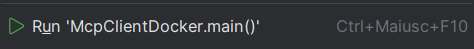
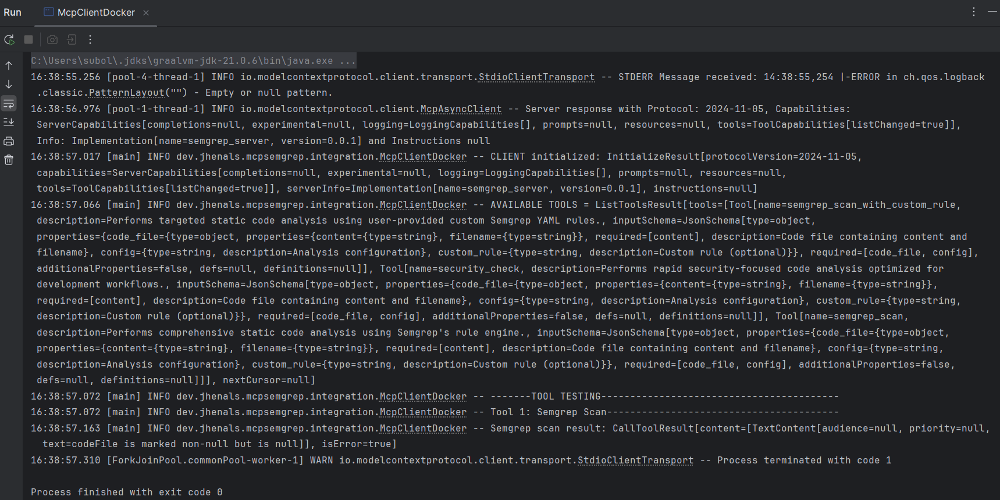
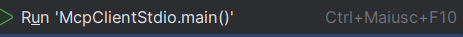

# MCP Semgrep Server

A Spring Boot-based Model Context Protocol (MCP) server that provides automated static analysis and security scanning capabilities to LLMs through Semgrep integration.

## Table of Contents

- [Project Purpose](#project-purpose)
- [Features](#-features)
- [Project Structure](#-project-structure)
- [Technology Stack](#-technology-stack)
- [Prerequisites](#-prerequisites)
- [Quick Start](#-quick-start)
- [Available MCP Tools](#-available-mcp-tools)
- [Running Unit and Integration Tests](#-running-unit-and-integration-tests)
- [Docker Configuration](#-docker-configuration)
- [Integration with LLMs](#-integration-with-llms)
- [Related Projects](#-related-projects)

---

## Project Purpose
The MCP Semgrep Server project aims to provide an automated extensible, and scalable static code analysis tool to large language models (LLMs) via the Model Context Protocol (MCP). This server enables seamless security scanning and code quality checks within AI-assisted development workflows, empowering AI tools to detect vulnerabilities, enforce coding standards, and improve software security across multiple programming languages. 

## 🚀 Features

- **Static Code Analysis**: Comprehensive code scanning with configurable Semgrep rulesets
- **Custom Rules Support**: Execute scans with user-defined YAML rules
- **Security-Focused Scanning**: Quick security vulnerability detection
- **Multi-language Support**: Works with any language supported by Semgrep
- **Docker Ready**: Containerized deployment with all dependencies
- **MCP Integration**: Seamless integration with AI assistants supporting MCP

## 📁 Project Structure
```
mcp-semgrep-server/
├── src/
│   ├── main/java/dev/jhenals/mcpsemgrep/  # Application source code
│   │   ├── controller/                    # MCP tool controllers
│   │   ├── service/                       # Business logic services
│   │   ├── model/                         # Data models
│   │   ├── util/                          # Utility classes
│   │   └── McpSemgrepServerApplication.java
│   ├── test/java/                         # Unit tests
│   └── main/resources/                    # Configuration files
├── dummy-data/                            # Test data for development
├── Dockerfile.multistage                  # Multi-stage Docker build
├── docker-compose.yml                     # Docker Compose configuration
├── pom.xml                                # Maven dependencies
└── README.md
```
## 🛠️ Technology Stack

- **Java 21**
- **Spring Boot 3.5.0**
- **Spring AI MCP Server**
- **Semgrep CLI**
- **Maven** for build management
- **Docker** for containerization

## 📋 Prerequisites

### For Local Development
- Java 21 or higher
- Maven 3.6+
- Python 3.8+ (for installing Semgrep)
- Semgrep CLI (`pip install semgrep`)

### For Docker Deployment
- Docker Engine
- Docker Compose (optional)

## 🚀 Quick Start

### Option 1: Local Development

1. **Clone and setup**
   ```bash
   git clone https://github.com/jhenals/mcp-code-review-assistant.git
   cd mcp-code-review-assistant
   ```

2. **Install Semgrep**
   ```bash
   pip install semgrep
   ```

3. **Build and run**
   ```bash
   cd mcp-mcpsemgrep-server
   ./mvnw spring-boot:run
   ```


### Option 2: Docker

1. **Clone the repository**
   ```bash
   git clone https://github.com/jhenals/mcp-code-review-assistant.git
   cd mcp-code-review-assistant//mcp-mcpsemgrep-server
   ```

2. **Build the application**
   ```bash
   ./mvnw clean package -DskipTests
   ```

3. **Build and run Docker container**
   Make sure Docker engine is running before executing the Docker commands. To build manually:

   ```bash
   docker build -f Dockerfile.multistage -t mcp-semgrep-server .
   docker run -p 8080:8080 mcp-semgrep-server
   ```

## 🔧 Available MCP Tools

The current version of the server exposes three main tools for code analysis:

### 1. `semgrep_scan`
**Description**: Performs general code scanning with configurable rulesets

**Input Format**:
```json
{
  "code_file": {
    "filename": "Example.java",
    "content": "public class Example { ... }"
  },
  "config": "auto",
   "customRule" : null
}
```
Supported config values:

* `auto` - Automatic ruleset selection based on language detection
* `p/security `- Security-focused policy pack
* `p/owasp-top-10` - OWASP Top 10 vulnerabilities
* `r/java`, `r/python`, `r/javascript` - Language-specific rulesets

### 2. `semgrep_scan_with_custom_rule`
**Description**: Performs code scanning with user-provided YAML rules

**Input Format**:
```json
{
  "code_file": {
    "filename": "Example.java", 
    "content": "public class Example { ... }"
  },
   "config": "auto",
  "rule": "rules:\n  - id: custom-rule\n    pattern: ...\n    ..."
}
```

### 3. `security_check`
**Description**: Performs a quick security-focused scan with formatted output

**Input Format**:
```json
{
  "code_file": {
    "filename": "Example.java",
    "content": "public class Example { ... }"
  },
  "config": "p/security", 
   "customRule": null
}
```

N.B.: If not indicated, config will automatically set to "auto"

## 📊 Output Format

All tools return a `AnalysisResult` object containing:

```json
{
  "findings": [
    {
      "ruleId": "java.lang.security.audit.hardcoded-password",
      "message": "Hardcoded password detected",
      "severity": "HIGH",
      "line": 5,
      "column": 20,
      "file": "Example.java"
    }
  ],
  "errors": [],
  "scannedPaths": ["Example.java"],
  "summary": "Found 1 security issue"
}
```

## 🔍 Supported Semgrep Configurations

- **`auto`**: Automatic ruleset selection based on language detection
- **Registry rules**: `r/java`, `r/python`, `r/javascript`, etc.
- **Policy packs**: `p/security`, `p/owasp-top-10`, `p/cwe-top-25`, etc.
- **Custom rules**: Provide your own YAML rule definitions
- **File paths**: Absolute paths to local rule files

## 🧪 Running Unit and Integration Tests

### Unit Test

The project includes comprehensive unit tests for:
- Static analysis service functionality
- Security check operations
- Semgrep utility functions
- MCP tool integration

Run the test suite:

```bash
cd mcp-semgrep-server
./mvnw test
```

### MCP Client Integration Test
This project include two example clients demonstrating how to interact with the MCP server using different mechanisms:

#### **MCPClientDocker**
This client demonstrates starting MCP server inside a Docker container and communicating with it via standard input/output

_Prerequisites:_
* Docker engine installed and running in background
* Docker image available locally or remotely (in my case: mcp-semgrep-server)

_How to run:_

(Run from IDE) If you use an IDE like IntelliJ IDEA or Eclipse, you can right-click the MCPClientDocker class and run it as a Java application. 


This will:
* Start the MCP server inside a Docker container
* Initialized the client connection
* List the available tools
* Call the `semgrep_scan` tool with example Java code 
* Log the results



#### **MCPClientStdio**
This client demonstrates starting the MCP server as a local Java process using stdio transport

_Prerequisites:_
* Java installed
* The MCP server jar is built locally (run `./mvnw clean install -DskipTests` to build)
* Update the jarPath variable in McpClientStdio to point to your built jar file

_How to run:_
Option 1: Run from IDE
* If you use an IDE like IntelliJ IDEA or Eclipse, you can right-click the MCPClientStdio class and run it as a Java application. 


Option 2: Use Maven exec plugin to run the test class

```bash
./mvnw test-compile
./mvnw exec:java -Dexec.mainClass=dev.jhenals.mcpsemgrep.integration.McpClientStdio -Dexec.classpathScope=test

```
This will: 
* Start the MCP server as a local Java process
* Initialize the client connection
* List avaialable tools
* Run multiple tests including: 
  * Basic Semgrep scan
  * Security check scan
  * Custom rule scan
* Log the results of each test

Notes:
* Both clients use a 10-minute request timeout and enable client capabilities such as roots and sampling. 
* Logs will show detailed information about the initialization, available tools, and scan results. 
* Adjust the Docker image name or jar path as needed for your environment.

## 🐳 Docker Configuration

The project uses a multi-stage Dockerfile (Dockerfile.multistage) that:

* **Build stage:** Uses OpenJDK 21 with Maven to compile the application 
* **Runtime stage:** Uses OpenJDK 21 slim with Python 3 and Semgrep CLI 
* **Dependencies:** Installs all required system packages and Python dependencies 
* **Optimization:** Minimal final image size with only runtime dependencies 
* **Port:** Exposes port 8080

### Docker Compose
The included docker-compose.yml provides:

* Service configuration for the MCP server 
* Port mapping (8080:8080)
* Environment variable setup 
* Volume mounting for development


### Application Properties

Configure the server through `src/main/resources/application.properties`:

```properties
# Server configuration
server.port=8080

# Logging configuration  
logging.level.dev.jhenals=DEBUG
logging.level.root=INFO
```

## 🤝 Integration with LLMs

This MCP server can be integrated with LLMs that support the Model Context Protocol:

1. **Claude Desktop**: Add server configuration to your MCP settings

Example MCP client configuration:
```json
{
  "mcpServers":{
      "semgrep-server": {
      "command": "java",
      "args": [
        "-jar",
        "/path/to/mcp-mcpsemgrep-server.jar"
      ]
    }
  }
}
```

## 🔗 Related Projects

- [Semgrep](https://semgrep.dev/) - Static analysis tool
- [Model Context Protocol](https://modelcontextprotocol.io/) - Protocol specification
- [Spring AI](https://spring.io/projects/spring-ai) - AI integration framework